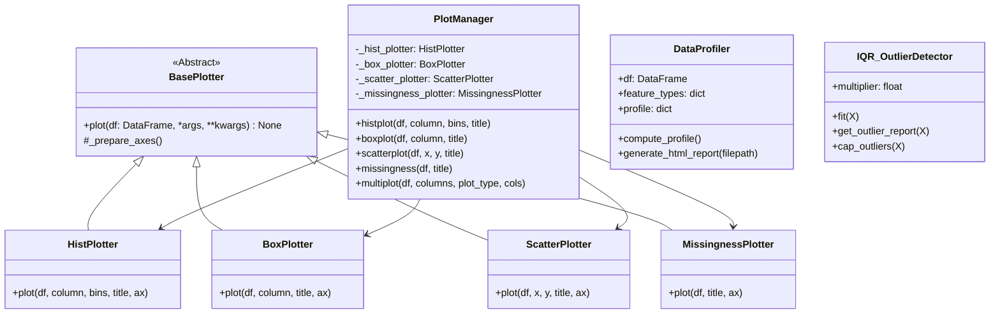

# EDA Package UML Class Diagram

## Description
- **PlotManager**: A Facade that simplifies plotting operations for the user.
- **BasePlotter** and its implementations: They adhere to the Single Responsibility Principle, each handling exactly one type of plot.
- **DataProfiler**: Responsible for typing features and gathering pure text properties into an aesthetically styled HTML report.
- **IQR_OutlierDetector**: Calculates IQR thresholds and caps outliers.
