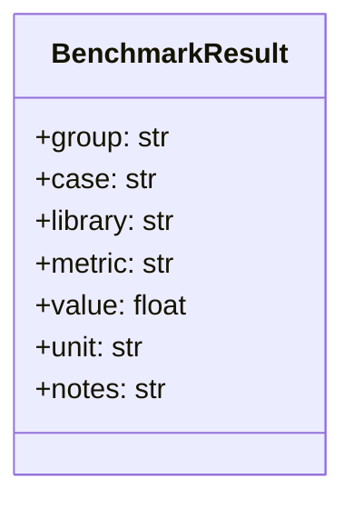

# glassbox-benchmark Detailed UML

```mermaid
classDiagram
    class BenchmarkResult {
        +group: str
        +case: str
        +library: str
        +metric: str
        +value: float
        +unit: str
        +notes: str
    }
```
