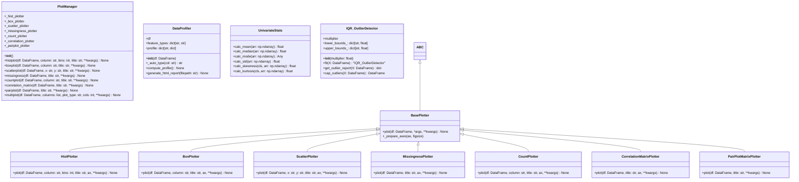

# glassbox-eda Detailed UML

```mermaid
classDiagram
    class BasePlotter {
        +plot(df: DataFrame, *args, **kwargs)  None
        +_prepare_axes(ax, figsize)
    }
    class HistPlotter {
        +plot(df: DataFrame, column: str, bins: int, title: str, ax, **kwargs)  None
    }
    class BoxPlotter {
        +plot(df: DataFrame, column: str, title: str, ax, **kwargs)  None
    }
    class ScatterPlotter {
        +plot(df: DataFrame, x: str, y: str, title: str, ax, **kwargs)  None
    }
    class MissingnessPlotter {
        +plot(df: DataFrame, title: str, ax, **kwargs)  None
    }
    class CountPlotter {
        +plot(df: DataFrame, column: str, title: str, ax, **kwargs)  None
    }
    class CorrelationMatrixPlotter {
        +plot(df: DataFrame, title: str, ax, **kwargs)  None
    }
    class PairPlotMatrixPlotter {
        +plot(df: DataFrame, title: str, **kwargs)  None
    }
    class PlotManager {
        +_hist_plotter
        +_box_plotter
        +_scatter_plotter
        +_missingness_plotter
        +_count_plotter
        +_correlation_plotter
        +_pairplot_plotter
        +__init__()
        +histplot(df: DataFrame, column: str, bins: int, title: str, **kwargs)  None
        +boxplot(df: DataFrame, column: str, title: str, **kwargs)  None
        +scatterplot(df: DataFrame, x: str, y: str, title: str, **kwargs)  None
        +missingness(df: DataFrame, title: str, **kwargs)  None
        +countplot(df: DataFrame, column: str, title: str, **kwargs)  None
        +correlation_matrix(df: DataFrame, title: str, **kwargs)  None
        +pairplot(df: DataFrame, title: str, **kwargs)  None
        +multiplot(df: DataFrame, columns: list<str>, plot_type: str, cols: int, **kwargs)  None
    }
    class DataProfiler {
        +df
        +feature_types: dict[str, str]
        +profile: dict[str, dict]
        +__init__(df: DataFrame)
        +_auto_type(col: str)  str
        +compute_profile()  None
        +generate_html_report(filepath: str)  None
    }
    class UnivariateStats {
        +calc_mean(arr: np.ndarray)  float
        +calc_median(arr: np.ndarray)  float
        +calc_mode(arr: np.ndarray)  Any
        +calc_std(arr: np.ndarray)  float
        +calc_skewness(cls, arr: np.ndarray)  float
        +calc_kurtosis(cls, arr: np.ndarray)  float
    }
    class IQR_OutlierDetector {
        +multiplier
        +lower_bounds_: dict[str, float]
        +upper_bounds_: dict[str, float]
        +__init__(multiplier: float)
        +fit(X: DataFrame)  "IQR_OutlierDetector"
        +get_outlier_report(X: DataFrame)  dict<str, int>
        +cap_outliers(X: DataFrame)  DataFrame
    }
    ABC <|-- BasePlotter
    BasePlotter <|-- HistPlotter
    BasePlotter <|-- BoxPlotter
    BasePlotter <|-- ScatterPlotter
    BasePlotter <|-- MissingnessPlotter
    BasePlotter <|-- CountPlotter
    BasePlotter <|-- CorrelationMatrixPlotter
    BasePlotter <|-- PairPlotMatrixPlotter
```
