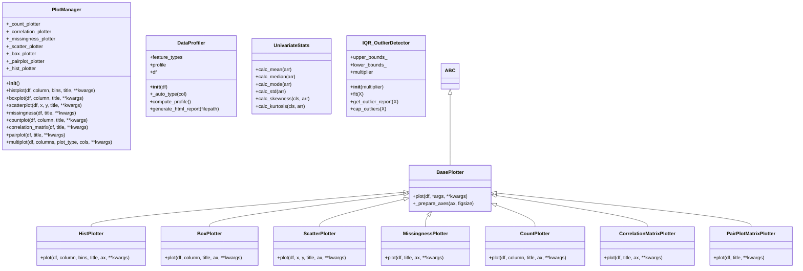

# glassbox-eda Detailed UML

```mermaid
classDiagram
    class BasePlotter {
        +plot(df, *args, **kwargs)
        +_prepare_axes(ax, figsize)
    }
    class HistPlotter {
        +plot(df, column, bins, title, ax, **kwargs)
    }
    class BoxPlotter {
        +plot(df, column, title, ax, **kwargs)
    }
    class ScatterPlotter {
        +plot(df, x, y, title, ax, **kwargs)
    }
    class MissingnessPlotter {
        +plot(df, title, ax, **kwargs)
    }
    class CountPlotter {
        +plot(df, column, title, ax, **kwargs)
    }
    class CorrelationMatrixPlotter {
        +plot(df, title, ax, **kwargs)
    }
    class PairPlotMatrixPlotter {
        +plot(df, title, **kwargs)
    }
    class PlotManager {
        +_count_plotter
        +_correlation_plotter
        +_missingness_plotter
        +_scatter_plotter
        +_box_plotter
        +_pairplot_plotter
        +_hist_plotter
        +__init__()
        +histplot(df, column, bins, title, **kwargs)
        +boxplot(df, column, title, **kwargs)
        +scatterplot(df, x, y, title, **kwargs)
        +missingness(df, title, **kwargs)
        +countplot(df, column, title, **kwargs)
        +correlation_matrix(df, title, **kwargs)
        +pairplot(df, title, **kwargs)
        +multiplot(df, columns, plot_type, cols, **kwargs)
    }
    class DataProfiler {
        +feature_types
        +profile
        +df
        +__init__(df)
        +_auto_type(col)
        +compute_profile()
        +generate_html_report(filepath)
    }
    class UnivariateStats {
        +calc_mean(arr)
        +calc_median(arr)
        +calc_mode(arr)
        +calc_std(arr)
        +calc_skewness(cls, arr)
        +calc_kurtosis(cls, arr)
    }
    class IQR_OutlierDetector {
        +upper_bounds_
        +lower_bounds_
        +multiplier
        +__init__(multiplier)
        +fit(X)
        +get_outlier_report(X)
        +cap_outliers(X)
    }
    ABC <|-- BasePlotter
    BasePlotter <|-- HistPlotter
    BasePlotter <|-- BoxPlotter
    BasePlotter <|-- ScatterPlotter
    BasePlotter <|-- MissingnessPlotter
    BasePlotter <|-- CountPlotter
    BasePlotter <|-- CorrelationMatrixPlotter
    BasePlotter <|-- PairPlotMatrixPlotter
```
