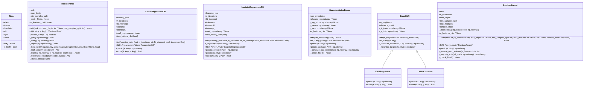

# glassbox-ml Detailed UML

```mermaid
classDiagram
    class _Node {
        +__slots__
        +feature
        +threshold
        +left
        +right
        +value
        +__init__()  None
        +is_leaf()  bool
    }
    class DecisionTree {
        +task
        +max_depth
        +min_samples_split
        -_root: _Node / None
        +n_features_: int / None
        +__init__(task: str, max_depth: int / None, min_samples_split: int)  None
        +fit(X: Any, y: Any)  "DecisionTree"
        +predict(X: Any)  np.ndarray
        -_gini(y: np.ndarray)  float
        -_mse(y: np.ndarray)  float
        -_impurity(y: np.ndarray)  float
        -_best_split(X: np.ndarray, y: np.ndarray)  tuple[int / None, float / None, float]
        -_leaf_value(y: np.ndarray)  Any
        -_build(X: np.ndarray, y: np.ndarray, depth: int)  _Node
        -_traverse(x: np.ndarray, node: _Node)  Any
        -_check_fitted()  None
    }
    class LinearRegressionGD {
        +learning_rate
        +n_iterations
        +fit_intercept
        +tolerance
        +intercept_
        +coef_: np.ndarray / None
        +loss_history_: list[float]
        +__init__(learning_rate: float, n_iterations: int, fit_intercept: bool, tolerance: float)
        +fit(X: Any, y: Any)  "LinearRegressionGD"
        +predict(X: Any)  np.ndarray
        +score(X: Any, y: Any)  float
    }
    class LogisticRegressionGD {
        +learning_rate
        +n_iterations
        +fit_intercept
        +tolerance
        +threshold
        +intercept_
        +coef_: np.ndarray / None
        +loss_history_: list[float]
        +__init__(learning_rate: float, n_iterations: int, fit_intercept: bool, tolerance: float, threshold: float)
        +_sigmoid(z: np.ndarray)  np.ndarray
        +fit(X: Any, y: Any)  "LogisticRegressionGD"
        +predict_proba(X: Any)  np.ndarray
        +predict(X: Any)  np.ndarray
        +score(X: Any, y: Any)  float
    }
    class GaussianNaiveBayes {
        +var_smoothing
        +classes_: np.ndarray / None
        -_log_priors: np.ndarray / None
        -_means: np.ndarray / None
        -_vars: np.ndarray / None
        +n_features_: int / None
        +__init__(var_smoothing: float)  None
        +fit(X: Any, y: Any)  "GaussianNaiveBayes"
        +predict(X: Any)  np.ndarray
        +predict_proba(X: Any)  np.ndarray
        -_compute_log_posteriors(X: np.ndarray)  np.ndarray
        -_check_fitted()  None
    }
    class _BaseKNN {
        +n_neighbors
        +distance_metric
        -_X_train: np.ndarray / None
        -_y_train: np.ndarray / None
        +__init__(n_neighbors: int, distance_metric: str)
        +fit(X: Any, y: Any)
        -_compute_distances(X: np.ndarray)  np.ndarray
        -_neighbor_targets(X: Any)  np.ndarray
    }
    class KNNRegressor {
        +predict(X: Any)  np.ndarray
        +score(X: Any, y: Any)  float
    }
    class KNNClassifier {
        +predict(X: Any)  np.ndarray
        +score(X: Any, y: Any)  float
    }
    class RandomForest {
        +task
        +n_estimators
        +max_depth
        +min_samples_split
        +max_features
        +random_state
        -_trees: list[tuple[DecisionTree, np.ndarray]]
        +n_features_: int / None
        +__init__(task: str, n_estimators: int, max_depth: int / None, min_samples_split: int, max_features: int / float / str / None, random_state: int / None)  None
        +fit(X: Any, y: Any)  "RandomForest"
        +predict(X: Any)  np.ndarray
        -_resolve_max_features(n_features: int)  int
        -_majority_vote(all_preds: np.ndarray)  np.ndarray
        -_check_fitted()  None
    }
    _BaseKNN <|-- KNNRegressor
    _BaseKNN <|-- KNNClassifier
```
