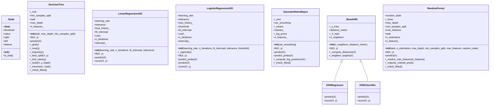

# glassbox-ml Detailed UML

```mermaid
classDiagram
    class _Node {
        +__slots__
        +threshold
        +value
        +right
        +left
        +feature
        +__init__()
        +is_leaf()
    }
    class DecisionTree {
        +_root
        +min_samples_split
        +task
        +max_depth
        +n_features_
        +__init__(task, max_depth, min_samples_split)
        +fit(X, y)
        +predict(X)
        +_gini(y)
        +_mse(y)
        +_impurity(y)
        +_best_split(X, y)
        +_leaf_value(y)
        +_build(X, y, depth)
        +_traverse(x, node)
        +_check_fitted()
    }
    class LinearRegressionGD {
        +learning_rate
        +tolerance
        +loss_history_
        +fit_intercept
        +coef_
        +n_iterations
        +intercept_
        +__init__(learning_rate, n_iterations, fit_intercept, tolerance)
        +fit(X, y)
        +predict(X)
        +score(X, y)
    }
    class LogisticRegressionGD {
        +learning_rate
        +tolerance
        +loss_history_
        +threshold
        +fit_intercept
        +coef_
        +n_iterations
        +intercept_
        +__init__(learning_rate, n_iterations, fit_intercept, tolerance, threshold)
        +_sigmoid(z)
        +fit(X, y)
        +predict_proba(X)
        +predict(X)
        +score(X, y)
    }
    class GaussianNaiveBayes {
        +_vars
        +var_smoothing
        +_means
        +classes_
        +_log_priors
        +n_features_
        +__init__(var_smoothing)
        +fit(X, y)
        +predict(X)
        +predict_proba(X)
        +_compute_log_posteriors(X)
        +_check_fitted()
    }
    class _BaseKNN {
        +_y_train
        +distance_metric
        +_X_train
        +n_neighbors
        +__init__(n_neighbors, distance_metric)
        +fit(X, y)
        +_compute_distances(X)
        +_neighbor_targets(X)
    }
    class KNNRegressor {
        +predict(X)
        +score(X, y)
    }
    class KNNClassifier {
        +predict(X)
        +score(X, y)
    }
    class RandomForest {
        +random_state
        +_trees
        +max_depth
        +min_samples_split
        +max_features
        +task
        +n_estimators
        +n_features_
        +__init__(task, n_estimators, max_depth, min_samples_split, max_features, random_state)
        +fit(X, y)
        +predict(X)
        +_resolve_max_features(n_features)
        +_majority_vote(all_preds)
        +_check_fitted()
    }
    _BaseKNN <|-- KNNRegressor
    _BaseKNN <|-- KNNClassifier
```
