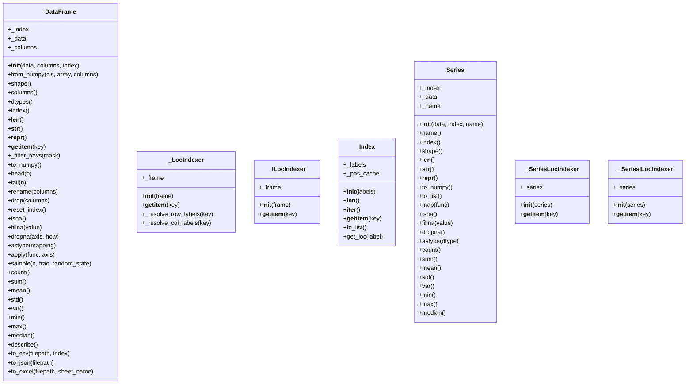

# glassbox-numpandas Detailed UML

```mermaid
classDiagram
    class DataFrame {
        +_index
        +_data
        +_columns
        +__init__(data, columns, index)
        +from_numpy(cls, array, columns)
        +shape()
        +columns()
        +dtypes()
        +index()
        +__len__()
        +__str__()
        +__repr__()
        +__getitem__(key)
        +_filter_rows(mask)
        +to_numpy()
        +head(n)
        +tail(n)
        +rename(columns)
        +drop(columns)
        +reset_index()
        +isna()
        +fillna(value)
        +dropna(axis, how)
        +astype(mapping)
        +apply(func, axis)
        +sample(n, frac, random_state)
        +count()
        +sum()
        +mean()
        +std()
        +var()
        +min()
        +max()
        +median()
        +describe()
        +to_csv(filepath, index)
        +to_json(filepath)
        +to_excel(filepath, sheet_name)
    }
    class _LocIndexer {
        +_frame
        +__init__(frame)
        +__getitem__(key)
        +_resolve_row_labels(key)
        +_resolve_col_labels(key)
    }
    class _ILocIndexer {
        +_frame
        +__init__(frame)
        +__getitem__(key)
    }
    class Index {
        +_labels
        +_pos_cache
        +__init__(labels)
        +__len__()
        +__iter__()
        +__getitem__(key)
        +to_list()
        +get_loc(label)
    }
    class Series {
        +_index
        +_data
        +_name
        +__init__(data, index, name)
        +name()
        +index()
        +shape()
        +__len__()
        +__str__()
        +__repr__()
        +to_numpy()
        +to_list()
        +map(func)
        +isna()
        +fillna(value)
        +dropna()
        +astype(dtype)
        +count()
        +sum()
        +mean()
        +std()
        +var()
        +min()
        +max()
        +median()
    }
    class _SeriesLocIndexer {
        +_series
        +__init__(series)
        +__getitem__(key)
    }
    class _SeriesILocIndexer {
        +_series
        +__init__(series)
        +__getitem__(key)
    }
```
