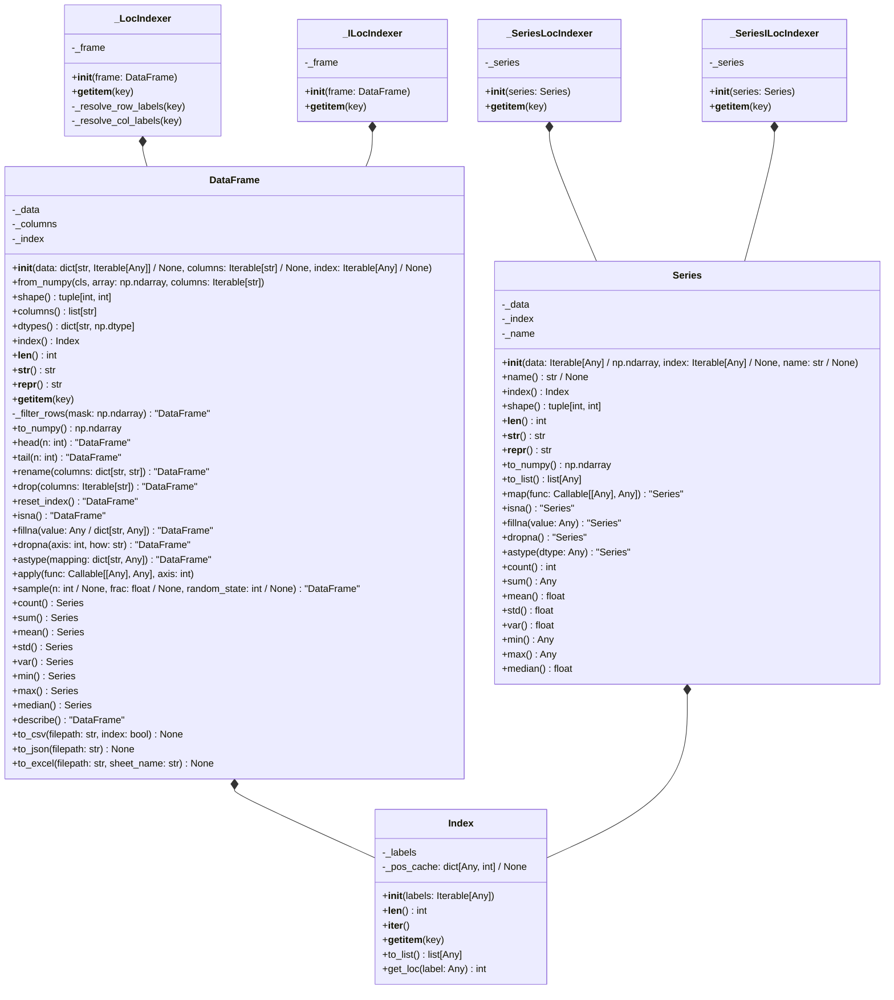

# glassbox-numpandas Detailed UML

```mermaid
classDiagram
    class DataFrame {
        -_data
        -_columns
        -_index
        +__init__(data: dict[str, Iterable[Any]] / None, columns: Iterable[str] / None, index: Iterable[Any] / None)
        +from_numpy(cls, array: np.ndarray, columns: Iterable[str])
        +shape()  tuple[int, int]
        +columns()  list[str]
        +dtypes()  dict[str, np.dtype]
        +index()  Index
        +__len__()  int
        +__str__()  str
        +__repr__()  str
        +__getitem__(key)
        -_filter_rows(mask: np.ndarray)  "DataFrame"
        +to_numpy()  np.ndarray
        +head(n: int)  "DataFrame"
        +tail(n: int)  "DataFrame"
        +rename(columns: dict[str, str])  "DataFrame"
        +drop(columns: Iterable[str])  "DataFrame"
        +reset_index()  "DataFrame"
        +isna()  "DataFrame"
        +fillna(value: Any / dict[str, Any])  "DataFrame"
        +dropna(axis: int, how: str)  "DataFrame"
        +astype(mapping: dict[str, Any])  "DataFrame"
        +apply(func: Callable[[Any], Any], axis: int)
        +sample(n: int / None, frac: float / None, random_state: int / None)  "DataFrame"
        +count()  Series
        +sum()  Series
        +mean()  Series
        +std()  Series
        +var()  Series
        +min()  Series
        +max()  Series
        +median()  Series
        +describe()  "DataFrame"
        +to_csv(filepath: str, index: bool)  None
        +to_json(filepath: str)  None
        +to_excel(filepath: str, sheet_name: str)  None
    }
    class _LocIndexer {
        -_frame
        +__init__(frame: DataFrame)
        +__getitem__(key)
        -_resolve_row_labels(key)
        -_resolve_col_labels(key)
    }
    class _ILocIndexer {
        -_frame
        +__init__(frame: DataFrame)
        +__getitem__(key)
    }
    class Index {
        -_labels
        -_pos_cache: dict[Any, int] / None
        +__init__(labels: Iterable[Any])
        +__len__()  int
        +__iter__()
        +__getitem__(key)
        +to_list()  list[Any]
        +get_loc(label: Any)  int
    }
    class Series {
        -_data
        -_index
        -_name
        +__init__(data: Iterable[Any] / np.ndarray, index: Iterable[Any] / None, name: str / None)
        +name()  str / None
        +index()  Index
        +shape()  tuple[int, int]
        +__len__()  int
        +__str__()  str
        +__repr__()  str
        +to_numpy()  np.ndarray
        +to_list()  list[Any]
        +map(func: Callable[[Any], Any])  "Series"
        +isna()  "Series"
        +fillna(value: Any)  "Series"
        +dropna()  "Series"
        +astype(dtype: Any)  "Series"
        +count()  int
        +sum()  Any
        +mean()  float
        +std()  float
        +var()  float
        +min()  Any
        +max()  Any
        +median()  float
    }
    class _SeriesLocIndexer {
        -_series
        +__init__(series: Series)
        +__getitem__(key)
    }
    class _SeriesILocIndexer {
        -_series
        +__init__(series: Series)
        +__getitem__(key)
    }
    
    DataFrame *-- Index
    Series *-- Index
    _LocIndexer *-- DataFrame
    _ILocIndexer *-- DataFrame
    _SeriesLocIndexer *-- Series
    _SeriesILocIndexer *-- Series
```
