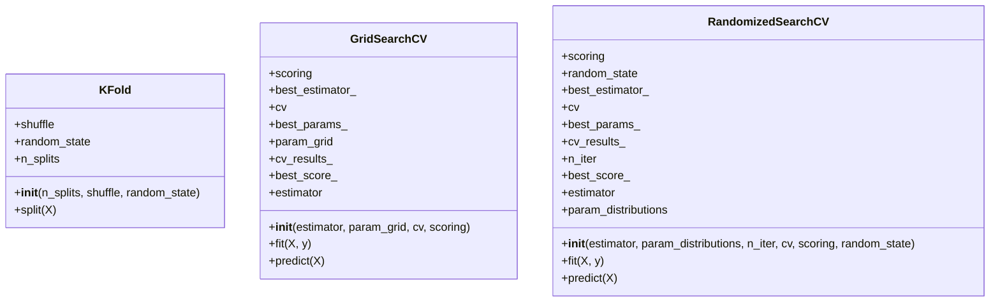

# glassbox-optimization Detailed UML

```mermaid
classDiagram
    class KFold {
        +shuffle
        +random_state
        +n_splits
        +__init__(n_splits, shuffle, random_state)
        +split(X)
    }
    class GridSearchCV {
        +scoring
        +best_estimator_
        +cv
        +best_params_
        +param_grid
        +cv_results_
        +best_score_
        +estimator
        +__init__(estimator, param_grid, cv, scoring)
        +fit(X, y)
        +predict(X)
    }
    class RandomizedSearchCV {
        +scoring
        +random_state
        +best_estimator_
        +cv
        +best_params_
        +cv_results_
        +n_iter
        +best_score_
        +estimator
        +param_distributions
        +__init__(estimator, param_distributions, n_iter, cv, scoring, random_state)
        +fit(X, y)
        +predict(X)
    }
```
