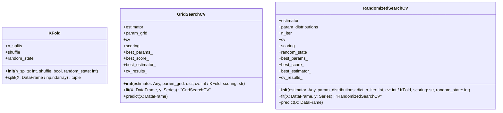

# glassbox-optimization Detailed UML

```mermaid
classDiagram
    class KFold {
        +n_splits
        +shuffle
        +random_state
        +__init__(n_splits: int, shuffle: bool, random_state: int)
        +split(X: DataFrame / np.ndarray)  tuple<np.ndarray, np.ndarray>
    }
    class GridSearchCV {
        +estimator
        +param_grid
        +cv
        +scoring
        +best_params_
        +best_score_
        +best_estimator_
        +cv_results_
        +__init__(estimator: Any, param_grid: dict<str, list>, cv: int / KFold, scoring: str)
        +fit(X: DataFrame, y: Series)  "GridSearchCV"
        +predict(X: DataFrame)
    }
    class RandomizedSearchCV {
        +estimator
        +param_distributions
        +n_iter
        +cv
        +scoring
        +random_state
        +best_params_
        +best_score_
        +best_estimator_
        +cv_results_
        +__init__(estimator: Any, param_distributions: dict<str, list>, n_iter: int, cv: int / KFold, scoring: str, random_state: int)
        +fit(X: DataFrame, y: Series)  "RandomizedSearchCV"
        +predict(X: DataFrame)
    }
```
