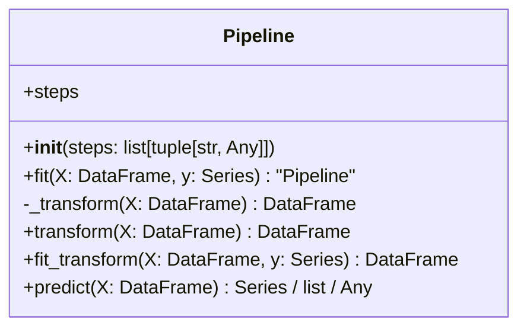

# glassbox-pipeline Detailed UML

```mermaid
classDiagram
    class Pipeline {
        +steps
        +__init__(steps: list[tuple[str, Any]])
        +fit(X: DataFrame, y: Series)  "Pipeline"
        -_transform(X: DataFrame)  DataFrame
        +transform(X: DataFrame)  DataFrame
        +fit_transform(X: DataFrame, y: Series)  DataFrame
        +predict(X: DataFrame)  Series / list / Any
    }
```
