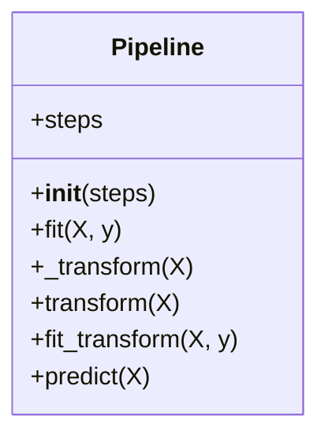

# glassbox-pipeline Detailed UML

```mermaid
classDiagram
    class Pipeline {
        +steps
        +__init__(steps)
        +fit(X, y)
        +_transform(X)
        +transform(X)
        +fit_transform(X, y)
        +predict(X)
    }
```
