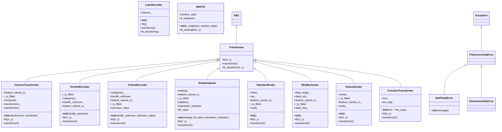

# glassbox-preprocessing Detailed UML

```mermaid
classDiagram
    class Transformer {
        +fit(X, y)
        +transform(X)
        +fit_transform(X, y)
    }
    class ColumnTransformer {
        +feature_names_in_
        +_is_fitted
        +remainder
        +transformers_
        +transformers
        +__init__(transformers, remainder)
        +fit(X, y)
        +transform(X)
    }
    class OneHotEncoder {
        +_is_fitted
        +categories_
        +handle_unknown
        +feature_names_in_
        +__init__(handle_unknown)
        +fit(X, y)
        +transform(X)
    }
    class OrdinalEncoder {
        +categories_
        +handle_unknown
        +feature_names_in_
        +_is_fitted
        +unknown_value
        +__init__(handle_unknown, unknown_value)
        +fit(X, y)
        +transform(X)
    }
    class LabelEncoder {
        +classes_
        +__init__()
        +fit(y)
        +transform(y)
        +fit_transform(y)
    }
    class PreprocessingError {
    }
    class NotFittedError {
        +__init__(message)
    }
    class DimensionalityError {
    }
    class SimpleImputer {
        +strategy
        +feature_names_in_
        +_is_fitted
        +statistics_
        +imputation_indicator
        +fill_value
        +__init__(strategy, fill_value, imputation_indicator)
        +fit(X, y)
        +transform(X)
    }
    class StandardScaler {
        +mean_
        +var_
        +feature_names_in_
        +_is_fitted
        +scale_
        +__init__()
        +fit(X, y)
        +transform(X)
    }
    class MinMaxScaler {
        +data_range_
        +data_min_
        +feature_names_in_
        +_is_fitted
        +data_max_
        +__init__()
        +fit(X, y)
        +transform(X)
    }
    class RobustScaler {
        +center_
        +_is_fitted
        +feature_names_in_
        +scale_
        +__init__()
        +fit(X, y)
        +transform(X)
    }
    class SMOTE {
        +random_state
        +k_neighbors
        +__init__(k_neighbors, random_state)
        +fit_resample(X, y)
    }
    class FunctionTransformer {
        +func
        +kw_args
        +__init__(func, **kw_args)
        +fit(X, y)
        +transform(X)
    }
    ABC <|-- Transformer
    Transformer <|-- ColumnTransformer
    Transformer <|-- OneHotEncoder
    Transformer <|-- OrdinalEncoder
    Exception <|-- PreprocessingError
    PreprocessingError <|-- NotFittedError
    PreprocessingError <|-- DimensionalityError
    Transformer <|-- SimpleImputer
    Transformer <|-- StandardScaler
    Transformer <|-- MinMaxScaler
    Transformer <|-- RobustScaler
    Transformer <|-- FunctionTransformer
```
