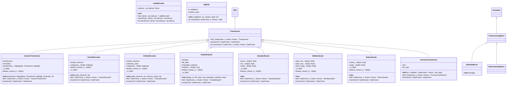

# glassbox-preprocessing Detailed UML

```mermaid
classDiagram
    class Transformer {
        +fit(X: DataFrame, y: Series / None)  "Transformer"
        +transform(X: DataFrame)  DataFrame
        +fit_transform(X: DataFrame, y: Series / None)  DataFrame
    }
    class ColumnTransformer {
        +transformers
        +remainder
        +transformers_: list[tuple[str, Transformer, list[str]]]
        -_is_fitted
        +feature_names_in_: list[str]
        +__init__(transformers: list[tuple[str, Transformer, list[str]]], remainder: str)
        +fit(X: DataFrame, y: Series / None)  "ColumnTransformer"
        +transform(X: DataFrame)  DataFrame
    }
    class OneHotEncoder {
        +handle_unknown
        +categories_: dict[str, list[any]]
        +feature_names_in_: list[str]
        -_is_fitted
        +__init__(handle_unknown: str)
        +fit(X: DataFrame, y: Series / None)  "OneHotEncoder"
        +transform(X: DataFrame)  DataFrame
    }
    class OrdinalEncoder {
        +handle_unknown
        +unknown_value
        +categories_: dict[str, list[any]]
        +feature_names_in_: list[str]
        -_is_fitted
        +__init__(handle_unknown: str, unknown_value: int)
        +fit(X: DataFrame, y: Series / None)  "OrdinalEncoder"
        +transform(X: DataFrame)  DataFrame
    }
    class LabelEncoder {
        +classes_: np.ndarray / None
        +__init__()
        +fit(y: Series / np.ndarray)  "LabelEncoder"
        +transform(y: Series / np.ndarray)  np.ndarray
        +fit_transform(y: Series / np.ndarray)  np.ndarray
    }
    class PreprocessingError {
    }
    class NotFittedError {
        +__init__(message)
    }
    class DimensionalityError {
    }
    class SimpleImputer {
        +strategy
        +fill_value
        +imputation_indicator
        +statistics_: dict[str, any]
        +feature_names_in_: list[str]
        -_is_fitted
        +__init__(strategy: str, fill_value: any, imputation_indicator: bool)
        +fit(X: DataFrame, y: Series / None)  "SimpleImputer"
        +transform(X: DataFrame)  DataFrame
    }
    class StandardScaler {
        +mean_: dict[str, float]
        +var_: dict[str, float]
        +scale_: dict[str, float]
        -_is_fitted
        +feature_names_in_: list[str]
        +__init__()
        +fit(X: DataFrame, y: Series / None)  "StandardScaler"
        +transform(X: DataFrame)  DataFrame
    }
    class MinMaxScaler {
        +data_min_: dict[str, float]
        +data_max_: dict[str, float]
        +data_range_: dict[str, float]
        -_is_fitted
        +feature_names_in_: list[str]
        +__init__()
        +fit(X: DataFrame, y: Series / None)  "MinMaxScaler"
        +transform(X: DataFrame)  DataFrame
    }
    class RobustScaler {
        +center_: dict[str, float]
        +scale_: dict[str, float]
        -_is_fitted
        +feature_names_in_: list[str]
        +__init__()
        +fit(X: DataFrame, y: Series / None)  "RobustScaler"
        +transform(X: DataFrame)  DataFrame
    }
    class SMOTE {
        +k_neighbors
        +random_state
        +__init__(k_neighbors: int, random_state: int)
        +fit_resample(X: DataFrame, y: Series)  tuple<DataFrame, Series>
    }
    class FunctionTransformer {
        +func
        +kw_args
        +__init__(func: Callable<<DataFrame, Any>, DataFrame> / None, **kw_args)
        +fit(X: DataFrame, y: Series / None)  "FunctionTransformer"
        +transform(X: DataFrame)  DataFrame
    }
    ABC <|-- Transformer
    Transformer <|-- ColumnTransformer
    Transformer <|-- OneHotEncoder
    Transformer <|-- OrdinalEncoder
    Exception <|-- PreprocessingError
    PreprocessingError <|-- NotFittedError
    PreprocessingError <|-- DimensionalityError
    Transformer <|-- SimpleImputer
    Transformer <|-- StandardScaler
    Transformer <|-- MinMaxScaler
    Transformer <|-- RobustScaler
    Transformer <|-- FunctionTransformer
```
