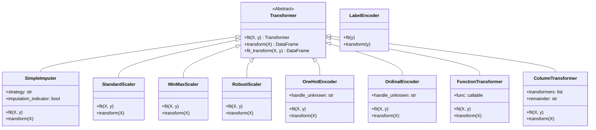

# Preprocessing Package UML Class Diagram

## Description
- **Transformer**: The abstract base class that establishes the unified `fit()`, `transform()`, and `fit_transform()` interface.
- **ColumnTransformer**: Combines multiple transformers applied to different specific columns of a `DataFrame`, similar to Scikit-Learn.
- **LabelEncoder vs OrdinalEncoder**: Note that `LabelEncoder` expects a 1D target `y` vector (or `Series`), while `OrdinalEncoder` processes categorical attributes defined in 2D inputs `X`.
