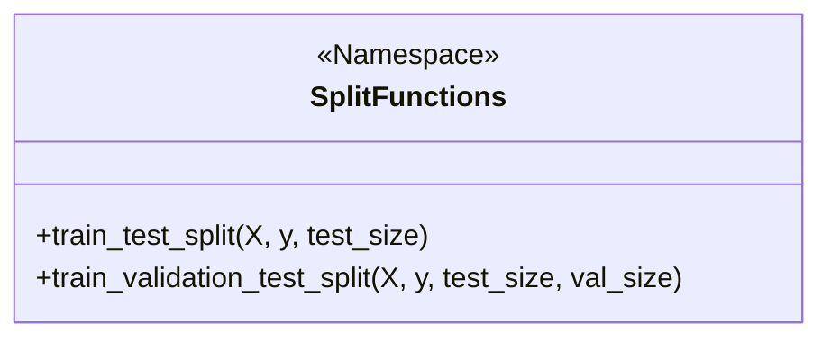

# Split UML

```mermaid
classDiagram
    class SplitFunctions {
        <<Namespace>>
        +train_test_split(X, y, test_size)
        +train_validation_test_split(X, y, test_size, val_size)
    }
```
